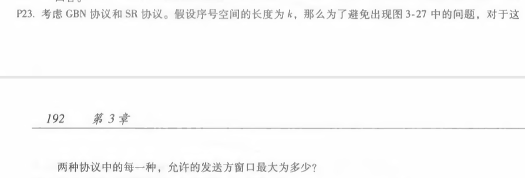
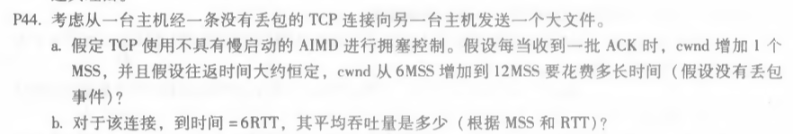
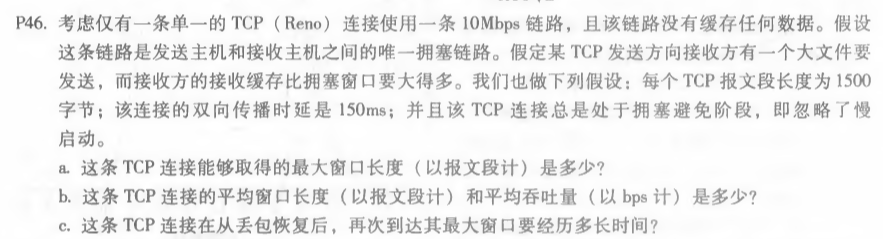

# 网络及分布式计算第六次作业

#### 2017302580018  刘佳媚

---

### 1、P23

##### 

  解：

为了避免图3.27出现的情况,应该避免让接受者窗口的最前端与发送窗口的最尾端交迭在同一个序列号空间中。

设序号为 0（第一个 0），1，…，k-1，0（第二个 0），窗口长度为N。

SR协议：

要使序列号发生混杂，那么接收方刚包含第二个0，其窗口为[k-N-1, 0]，同时第一个 0 在发送方窗口且恰好其 ACK 丢失，需要重发。0(第一个0)~k-N 为 k-N+1 个值，当窗口长度小于 k-N+1时，第一个 0 和第二个 0 不会交迭在同一个序列号空间中。
所以窗口长度 N <= k-N，即 N <= k/2

GBN协议： 

在本协议中，接收方丢弃所有的失序分组，如果分组m已经接受并交付，则所有序号比m小的分组也已经交付，N <= k 即可。

​        

------

### 2、P44

##### 

  解：

**a.**

因为每增加 1 个 MSS需要1个RTT，所以需要 6 个 RTT。

**b.**
报文段总数：6 + 7 + 8 + 9 + 10 + 11 = 51 MSS
平均吞吐量： 51MSS / 6RTT = 8.5 MSS/RTT

​        

---

### 3、P46

##### 

  解：

 **a.**
设最大窗口长度为 W 

因为W * MSS / RTT = 10Mbps     得： W = 125

**b.**
当窗口长度从 W/2 到 W时：
平均窗口长度：W平 =（W/2 + W）/ 2 = 0.75W = 94
平均吞吐量为：W平* MSS / RTT = 94 * 1500 * 8 / 0.15 = 7.52Mbps

**c.**
丢包后窗口长度：W丢 = W/2 + 3 = 65
从 W丢到 W所需时间：T = (W-W丢) * RTT = (125-65) * 150ms = 9s