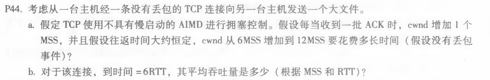
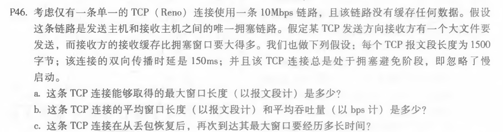

# 网络及分布式计算第六次作业

计算机学院-刁可 -2017302580031

1. P26

a. TCP 是字节流编号的， L 的最大值为 2^32 = 4294967296 byte

b. 报文数N = 2^32/536 +1 = 8012999

​     总头部长 = N *66 = 528857934 byte

​     总字节数 = Lmax + N 

​     t = 总字节数/155Mbps = 248.97 s

2. P44

   

   a. 每个 RTT 加 1 个 MSS，因此需要 6 个 RTT

   b. 6 + 7 + 8 + 9 + 10 + 11 = 51 MSS
       平均吞吐量为 51MSS / 6RTT = 8.5 MSS/RTT

3. P46

   

   a. 最大窗口长度 W 受限于链路速率：W * MSS / RTT = 10 Mbps ； 可得 W = 125

   b. 从 W/2 到 W：平均窗口长度为 0.75W = 94 ；平均吞吐量为 94 * 1500 * 8 / 0.15 = 7.52 Mbps

   c. 最小窗口= W/2 + 3 = 65 ；从最小窗口到最大窗口： (125-65)*150ms = 9 s