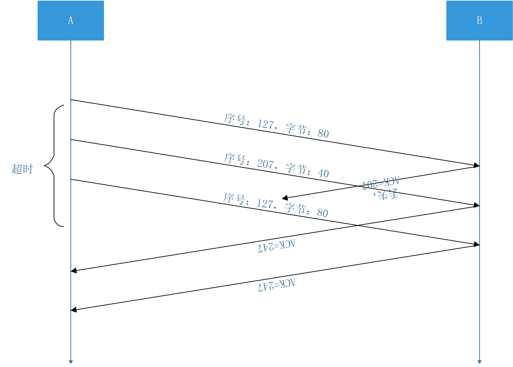
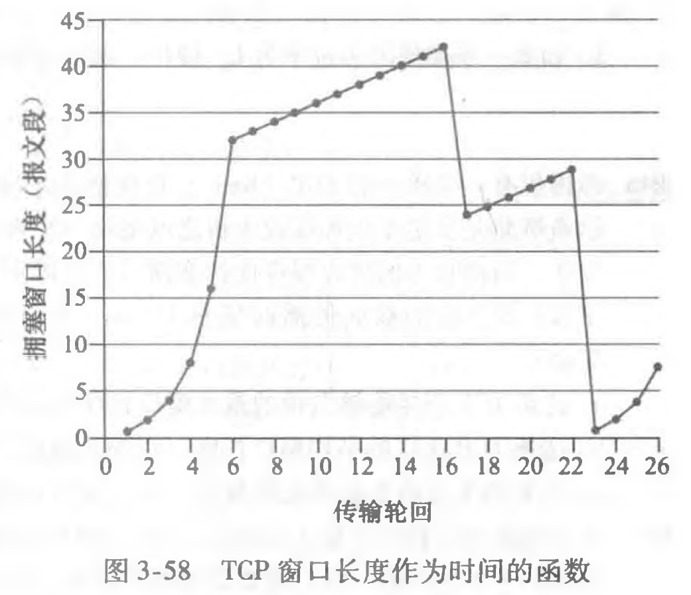

##### 2017302580112 张佳乐 第6次作业

P22 考虑一个GBN协议，其发送方窗口为4，序号范围为1024。假设在时刻t，接收方期待的下一个有序分组的序号是k。假设媒体不会对报文重新排序。回答以下问题：

a. 在t时刻，发送方窗口内的报文序号可能是多少？论证你的回答。

> 答：发送方的窗口大小N=4，假设在时刻t接收方期待的下一个有序分组的序号为k，则说明接收方已收到k-1号分组，并对之前收到的所有分组进行过确认。如果分组全部正确到达发送方，则此时发送方窗口内的报文序号是[k , k+N-1]。如果发送方没有收到所有应收到的ACK，此时发送方窗口内报文序号为[k-N , k-1]。因此发送方窗口内的报文序号可能是: [ k-4 , k-1 ]，[ k-3 , k ]，[ k-2 , k+1 ]，[ k-1 , k+2 ]，[ k , k+3 ]。

b. 在t时刻，在当前传播回发送方的所有可能报文中，ACK字段的所有可能值是多少？论证你的 回答。

> 答：从a中可以知道发送方发送报文序号最小为[k-N , k-1]，说明发送方已经收到了k-N-1的ACK确认，所以不会对k-N-1之前的分组再进行确认。所以ACK字段的所有可能值为[ k-5 , k-1 ]。

P27 主机A和B经一条TCP连接通信，并且主机B已经收到了来自A的最长为126字节的所有字节。 假定主机A随后向主机B发送两个紧接着的报文段。第一个和第二个报文段分别包含了80字节和40字节的数据。在第一个报文段中，序号是127,源端口号是302,目的地端口号是80。无论何时主机B接收到来自主机A的报文段，它都会发送确认。

a. 在从主机A发往B的第二个报文段中，序号、源端口号和目的端口号各是什么？

> 答：序号是 127 + 80 = 207，源端口号是302，目的端口号是80

b. 如果第一个报文段在第二个报文段之前到达，在第一个到达报文段的确认中，确认号、源端口号和目的端口号各是什么？

> 答：如果第一个报文段在第二个报文段之前到达，在第一个到达报文段的确认中，确认号是207，源端口是80，目的端口号是302

c. 如果第二个报文段在第一个报文段之前到达，在第一个到达报文段的确认中，确认号是什么？

> 答：如果第二个报文段在第一个报文段之前到达，在第一个到达报文段的确认中确认号是127

d. 假定由A发送的两个报文段按序到达B。第一个确认丢失了而第二个确认在第一个超时间隔之后到达。画出时序图，显示这些报文段和发送的所有其他报文段和确认。（假设没有其他分组丢失。）对于图上每个报文段，标出序号和数据的字节数量；对于你增加的每个应答，标出确认号。

> 答：

P40 考虑图3-58。假设TCP Reno是一个经历如上所示行为的协议，回答下列问题。在各种情况中，简要地论证你的回答。

a. 指出TCP慢启动运行时的时间间隔。

> 答：TCP慢启动时呈指数增长，运行时的时间间隔为[1 , 6]和[23 , 26]

b. 指出TCP拥塞避免运行时的时间间隔。

> 答：TCP拥塞避免运行时的时间间隔为[6 , 16]和[17 , 22]

c. 在第16个传输轮回之后，报文段的丢失是根据3个冗余ACK还是根据超时检测岀来的？

> 答：在第16个传输轮回之后报文段的丢失是根据3个冗余ACK检测出来的。因为拥塞窗口长度没有降到1个MSS而是减半

d. 在第22个传输轮回之后，报文段的丢失是根据3个冗余ACK还是根据超时检测出来的？

> 答：在第22个传输轮回之后报文段的丢失是根据超时检测出来的。因为拥塞窗口长度降到了1个MSS

e. 在第1个传输轮回里，ssthresh的初始值设置为多少？

> 答：在第1个传输轮回里，ssthresh的初始值设置成32个MSS，因为在第6轮传输时到达了阈值32。然后拥塞窗口开始以线性速度爬升，直到在第16轮传输后出现3个冗余ACK

f. 在第18个传输轮回里，ssthresh的值设置为多少？

> 答：在第18个传输轮回里，ssthresh的值被设置成21个MSS，因为当第16个周期丢包事件发生时，拥塞窗口值为42个MSS，所以ssthresh的值被设置成0.5 × cwnd = 21 × MSS

g. 在第24个传输轮回里，ssthresh的值设置为多少？

> 答：在第24个传输轮回里，ssthresh的值被设置成14.5个MSS，因为当第22个周期丢包事件第二次发生时，拥塞窗口值为29个MSS，所以ssthresh的值被设置成0.5 × cwnd = 14.5 × MSS

h. 在哪个传输轮回内发送第70个报文段？

> 答：在前6个传输周期中已经发送了1 + 2 + 4 + 8 + 16 + 32 = 63 个报文段，第7个传输轮回要发送32 + 1 = 33个报文段，即第64 - 96个报文段，所以第70个报文段在第7个传输轮回中发送

i. 假定在第26个传输轮回后，通过收到3个冗余ACK检测出有分组丢失，拥塞的窗口长度和 ssthresh的值应当是多少？

> 答：在第26个传输轮回时，拥塞窗口值为8个MSS，因此通过收到3个冗余ACK检测出有分组丢失时ssthresh的值被设置成0.5 × cwnd = 4 × MSS。拥塞窗口长度应当为4 + 3 = 7个MSS

j. 假定使用TCP Tahoe （而不是TCP Reno）,并假定在第16个传输轮回收到3个冗余ACK。在第19 个传输轮回，ssthresh和拥塞窗口长度是什么？

> 答：假定使用TCP Tahoe（不管是发生超时指示的丢包事件，还是发生3个冗余ACK指示的丢包事件，都无条件地将拥塞窗口减至1个MSS，并进入慢启动阶段），并假定在第16个传输轮回收到3个冗余ACK。在第19个传输轮回，ssthresh的值被设置成21个MSS，因为当第16个周期丢包事件发生时，拥塞窗口值为42个MSS，所以ssthresh的值被设置成0.5 × cwnd = 21 × MSS。但是此时拥塞窗口值为1个MSS

k.再次假设使用TCP Tahoe,在第22个传输轮回有一个超时事件。从第17个传输轮回到第22个传 输轮回（包括这两个传输轮回），一共发送了多少分组？

> 答：第17个传输轮回到第21个轮回分别传送了1 + 2 + 4 + 8 + 16 = 31个分组，第22个轮回传送分组为阈值21个，所以一共传送了52个分组
