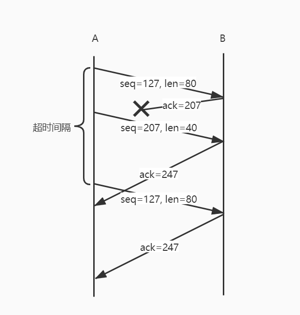

## 分布式与网络课程作业六

### P26:
a) TCP 是字节流编号的，共有 `2 ^ 32 = 4294967296` 个可能的序列。

b) 报文数： `L ÷ MSS = 4294967296 ÷ 536 = 8012999`；

报文长度：  `536 + 66 = 602 byte`；

总字节：    `8012999 × 602 = 4823825398‬ byte`；

传输时间：  `4823825398 byte‬ ÷ 155 Mbps = 248.97 s`。

### P27:
a) 序号为 `207`，源端口号为 `302`，目的端口号为 `80`。

b) 确认号为 `207`，源端口号为 `80`，目的端口号为 `302`。

c) 确认号为 `127`。

d) 

### P46:
a) 最大窗口长度（以报文段计）`W = 10Mbps × RTT ÷ MSS = 125`。

b) 该TCP连接总是处于拥塞避免阶段，因此 cwnd 大小在 W/2~W 之间变化，平均窗口大小为 `0.75 × W = 94`。平均吞吐量为 `94 * 1500 * 8 / 0.15 = 7.52 Mbps`。

c) 从丢包恢复后，cwnd 变为 W/2 = 62，因此再次到达其最大窗口需要 `(125-62) * RTT = 9.45 s`。
