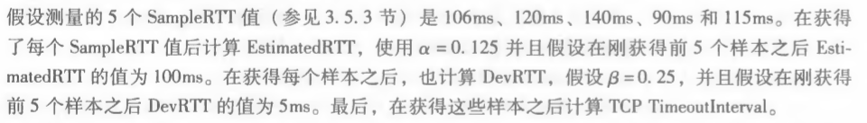
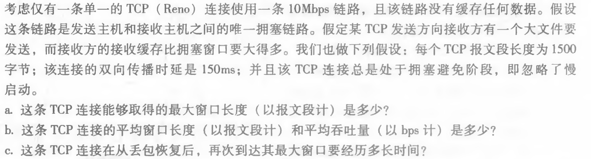

# Homework6

> 于佳艺 2017302580210

------

### P31.

**样本RTT** （**SampleRTT**）：就是从某报文段被发出（即交给IP）到对该报文段的确认被收到之间的时间量

> 大多数TCP 的实现仅在某个时刻做一次SampleRTT测量，而不是为每个发送的报文段测量一个SampleRTT。这就是说，在任意时刻，仅为一个已发送的但目前尚未被确认的报文段估计SampleRTT,从而产生一个接近每个RTT的新SampleRTT值。另外，TCP决不为已被重传的报 文段计算SampleRTT；它仅为传输一次的报文段测量SampleRTT

TCP维持一个SampleRTT**均值** （称为**EstimatedRTT**）。 一旦获得一个新SampleRTT时，TCP就会根据下列公式来更新EstimatedRTT: 
$$
EstimatedRTT = （1 - α） • EstimatedRTT + α • SampleRTT
$$
RTT偏差 **DevRTT**，用于估算SampleRTT 一般会偏离EstimatedRTT的程度： 
$$
DevRTT = （1 -β） • DevRTT +β • | SampleRTT - EstimatedRTT |
$$
设置和管理**重传超时间隔** ：
$$
Timeoutinterval = EstimatedRTT +4 • DevRTT
$$
解：

1) SampleRTT = 106 ms

EstimatedRTT = （1 - α） • EstimatedRTT + α • SampleRTT

​                          = （1 - 0.125）* 100 + 0.125 * 106

​                          =  100.75 ms

DevRTT = （1 -β） • DevRTT +β • | SampleRTT - EstimatedRTT |

​               = （1 - 0.25）* 5 + 0.25* |106 - 100.75|

​               =   5.0625 ms

Timeoutinterval = EstimatedRTT +4 • DevRTT

​                              = 100.75 + 4 * 5.0625

​                              =  121ms

2) SampleRTT = 120 ms

EstimatedRTT = （1 - α） • EstimatedRTT + α • SampleRTT

​                          = （1 - 0.125）* 100.75 + 0.125 * 120

​                          =   102.5  ms

DevRTT = （1 -β） • DevRTT +β • | SampleRTT - EstimatedRTT |

​               = （1 - 0.25）* 5.0625 + 0.25* |120 - 102.5|

​               =    8.125  ms

Timeoutinterval = EstimatedRTT +4 • DevRTT

​                              = 102.5 + 4 * 8.125

​                              =   135 ms

3) SampleRTT = 140 ms

​    EstimatedRTT = 105 ms

​    DevRTT = 12.5 ms

​    TimeoutInterval = 155 ms

4) SampleRTT = 90 ms

​    EstimatedRTT =  98.75 ms

​    DevRTT =  5.9375  ms

​    TimeoutInterval =  122.5 ms

5) SampleRTT = 115 ms

​    EstimatedRTT =   101.875 ms

​    DevRTT =   7.03125 ms

​    TimeoutInterval =   130 ms

### P44.

考虑从一台主机经一条没有丢包的TCP连接向另一台主机发送一个大文件。 

a. 假定TCP使用不具有慢启动的AIMD进行拥塞控制。假设每当收到一批ACK时，cwnd增加1个 MSS,并且假设往返时间大约恒定，cwnd从6MSS增加到12MSS要花费多长时间（假设没有丢包事件）？ 

b. 对于该连接，到时间=6RTT,其平均吞吐量是多少（根据MSS和RTT）? 

拥塞窗口表示为cwnd,它对一个TCP发送方能向网络中发送流量的 速率进行了限制。

将一个TCP发送方的“丢包事件”定义为：要么出现超时，要么收到来自接收方的3 个冗余ACK。

解：

a) 需要6个RTTS

b) （6+7+8+9+10+11）MSS / 6RTT = 8.5 MSS/RTT

### P46.

MSS: Maximum Segment Size 最大分段大小

 RTT = 传播时延（往返哒）+ 排队时延（路由器和交换机的）+ 数据处理时延（应用程序的）。 

解：

 a）最大窗口长度 W 受限于链路速率：W * MSS / RTT = 10Mbps    得到 W = 125

 b)   从 W/2 到 W：
       平均窗口长度为 0.75W = 94
       平均吞吐量为 94 * 1500 * 8 / 0.15 = 7.52Mbps 

 c）W’ = W/2 + 3 = 65
从 W’ 到 W：(125-65)*150ms = 9s 