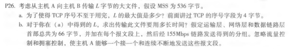
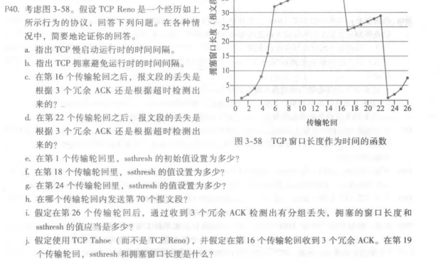
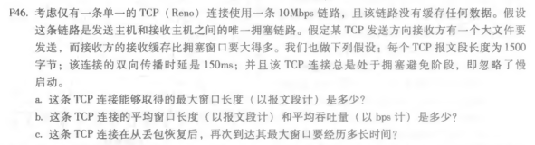

## NetworkDistribution_Homework6     

#### P26：
  
   
	a.   
	由于TCP的序号字段为4个字节，则其最大序号为2^32,则根据TCP是字节流编号的，L的最大值为2^32字节  
	b.  
	首先根据L的最大值求出报文数N N=2^32/536=8012999  
    然后求出报文的总字节数，总头部长加上数据长度：N*66 + 2^32 (byte)=4.824∗10^9 byte
    则传输的时长t=总字节数/155Mbps=4.824∗10^9 byte/155Mbps=4.824*8 * 10^9 / 155 /10^3=249s
    
#### P40：
  

	a.   
	TCP慢启动运行时即为拥塞窗口指数增长的时期，从图中可观察到慢启动运行时的时间间隔为 [1,6] 和 [23,26]   
	b.   
	TCP拥塞避免时为拥塞窗口加性增长的时期，时间间隔为 [6,16]和 [17,22]    
	c.  
	3个冗余ACK，因为16个传输轮回之后进行了快恢复而不是慢启动  
	d.   
	超时检测，因为这之后拥塞窗口降为1，进行了慢启动，说明检测超时   
	e.   
	设为了第6个传输轮回时拥塞窗口的长度，即慢启动向拥塞避免阶段的转折点， 说明ssthresh初始值为32  
	f.  
	因为在第16个传输轮回检测到丢失，ssthresh降为拥塞窗口长度的一半，则在第 18个传输轮回时ssthresh为 42/2 = 21   
	g.   
	当在传输轮回22期间检测到丢失时，拥塞窗口的大小为29。因此，阈值为14（取14.5的下限）    
	h.   
	在第1次传输轮回期间，数据包1被发送；  
	数据包2-3在第2次发送中发送传输轮回；  
	数据包4-7在第3传输轮回中发送；   
	数据包8-15在第4个传输轮回中发送；   
	数据包16-31在第5个传输中发送数据包32-63在第6个传输轮回中发送；   
	数据包64-96被发送在第7次传输轮回中。因此，在第7发送循环中发送分组70。   
	i.   
	ssthresh降为拥塞窗口长度的一半即 4，新的拥塞窗口长度为 ssthresh + 3 MSS = 7    
	j.   
	使用 TCP Tahoe 在第17个传输轮回时，拥塞窗口长度降为1，ssthresh变为 21，开始进行慢启动；   
	则在第19个传输轮回时，ssthresh依然为 21，拥塞窗口长度为4      
	k.  
	第17个传输轮回拥塞窗口长度从1开始，17到21传输轮回进行慢启动过程，发送的分组数为 1 + 2 + 4 + 8 + 16 = 31.    
	最后由于 ssthresh为 21，所以第 22个传输轮回发送分组数为21，一共发送的分组数为 31 + 21 = 52      
    
#### P46：   
  

	a.  
	链路上最多可以传输的字节数为 $10Mbps * 150ms = 1.5M/8$, 最大窗口为 $W_{max} = \frac{1.5M}{8} / 1500 = 125$   
	b.  
	窗口长度会在碰到最大窗口长度时（发生拥塞）进行乘性减，恢复到最大窗口长度的1/2 然后进行加性增.  
	一直反复这个过程，平均窗口长度为最大窗口长度的 （1 + 1/2）/2 = 3/4，即$W*\frac{3}{4} = 94$, 平均吞吐量 $Throughput_{avg} = W * \frac{3}{4} 1500 \div 150ms = 7.52Mbps$   
	c.  
	数据包丢失时，窗口长度变为原来的一半 $W/2 = 62$, 则根据加性增的性质，恢复所需的时间为 $T_{recover} = (125 - 62) * 150ms = 9.45s$   

****
#### author：2017302580217_董娜
