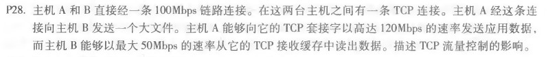

# 网络及分布式计算作业（五）

[toc]

## 课后习题

### P28



TCP 让发送方 A 维护一个接收窗口来提供流量控制，主机 B 将实时的 rwnd 值放入发给 A 的报文中，通知 B 的缓存大小。A 确保未确认（”飞行中“）数据的数量不超过rwnd，当缓存不足时，将暂停向 B 发送数据，以此保证发送数据不会溢出主机B的缓冲区。

### P31


$$EstimatedRTT= (1-a)\times EstimatedRTT+a\times SampleRTT$$

$$DevRTT = (1-\beta)*DevRTT +\beta*|SampleRTT-EstimatedRTT|$$

$$time Out Interval=EstimatedRTT+4\times DevRTT$$

```python
def getRTT(data_list, d_ertt=100, d_dev=5, a=0.125, b=0.25):
    for data in data_list:
        ERTT = (1 - a) * d_ertt + a * data
        devRTT = (1 - b) * d_dev + b * abs(data - ERTT)
        time_out = ERTT + 4 * devRTT
        print("+ SampleRTT =", data)
        print("EstimatedRTT =", ERTT)
        print("DevRTT =", devRTT)
        print("TimeoutInterval =", time_out)


getRTT([106, 120, 140, 90, 115])
```

计算结果

+ SampleRTT = 106
EstimatedRTT = 100.75
DevRTT = 5.0625
TimeoutInterval = 121.0
+ SampleRTT = 120
EstimatedRTT = 102.5
DevRTT = 8.125
TimeoutInterval = 135.0
+ SampleRTT = 140
EstimatedRTT = 105.0
DevRTT = 12.5
TimeoutInterval = 155.0
+ SampleRTT = 90
EstimatedRTT = 98.75
DevRTT = 5.9375
TimeoutInterval = 122.5
+ SampleRTT = 115
EstimatedRTT = 101.875
DevRTT = 7.03125
TimeoutInterval = 130.0

### P40


a. [1, 6] 和 (23, 26]

b. (6, 16] 和 (17, 22]

c. 三个冗余的ACK。检测到三个冗余的ACK触发快重传，cwnd被切成半个窗口，然后线性增长。

d. 超时。cwnd被设为一，重新开始慢启动过程。

e. 32。后续cwnd达到32后从指数增长变为线性增长。

f.  21。

g. 14。

h. 第七个传输轮回。前几个传输轮回传输的报文段依次为{1}、[2，3]、[4，7]、[8，15]，[16，31]，[32，63]，[64，96]

i. ssthresh = 4，cwnd = ssthresh + 3 = 7

j. 在第16个传输轮回时，ssthresh = cwnd/2 = 21，cwnd = 1 并进入慢启动状态，则在第19个传输轮回中，ssthreash = 21，cwnd = 1*2^2=4

k. 

第17个传输轮回：1个，cwnd=1，ssthresh=21

第18个传输轮回：2个，cwnd=2，ssthresh=21

第19个传输轮回：4个，cwnd=4，ssthresh=21

第20个传输轮回：8个，cwnd=8，ssthresh=21

第21个传输轮回：16个，cwnd=16，ssthresh=21

第22个传输轮回：21个，cwnd=21，ssthresh=21

共记 1 + 2 + 4 + 8 + 16 + 21 = 52 个

因此一共发送52个分组