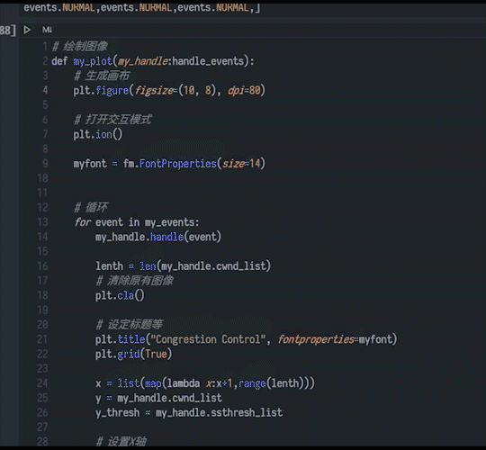

# TCP拥塞控制演示

## 慢开始
慢开始当中的“慢”并不是指cwnd的增长速率慢，而是在TCP开始发送报文段时先设置cwnd = 1,使得发送方在开始时只发送一一个报文段
- 当cwnd < ssthresh 时使用慢启动
- 当cwnd > ssthresh 时，停止使用慢启动算法，改用拥塞避免算法
## 拥塞避免

让拥塞窗口缓慢的增大，即每经过一个往返时间RTT就把发送方的拥塞窗口cwnd+1

1. TCP连接初始化，将拥塞窗口cwnd设置为1个报文段，即cwnd = 1;
2. 执行慢开始算法，cwnd按指数规律增长，知道cwnd == ssthresh时，开始执行拥塞避免算法，cwnd开始按照线性规律增长；
3. 当网络发生拥塞，把ssthresh值更新为拥塞前ssthresh值的一半，cwnd重新设置为1，再按照2执行；
## 快重传
如果接收方收到三个重复的ACK，那么发送方不必等待重传计时器到期，发送方尽早重传未被确认的报文段
## 快恢复
由于发送方现在认为网络很可能没有发生阻塞，因此现在不执行慢启动算法，而是把cwnd值设置为慢启动门限减半后的值，然后开始执行拥塞避免算法，拥塞窗口cwnd值线性增大。

# 代码实现

[具体代码](./congestion_control.ipynb)

定义了三种事件类型

``` python
class events(Enum):
    # 丢包，三次重复ACK
    LOSS_PACK = 1
    # 超时
    TIME_OUT = 2
    # 正常
    NORMAL = 3
```

处理事件

``` python
def handle(self,event:events):
        if event is events.LOSS_PACK: # 发生丢包
            self.ssthresh = self.cwnd/2
            self.cwnd = self.ssthresh+3
            self.print_res('loss')
            return
        elif event is events.NORMAL:
            temp = self.cwnd*2
            if self.cwnd is 0: # 初始为0
                self.cwnd=1
            elif self.cwnd>=self.ssthresh:# 大于阈值，线性增长
                self.cwnd+=1       
            elif temp>=self.ssthresh: # 即将超过阈值时，调整为阈值
                self.cwnd = self.ssthresh
            else: # 翻倍
                self.cwnd*=2
            self.print_res('normal')
            return
        elif event is events.TIME_OUT: # 发生超时事件
            self.ssthresh = self.cwnd/2
            self.cwnd = 1
            self.print_res('timeout')
            return
```

手动输入模拟的数据,下列为28个RTT时间内的事件

``` python
my_events=[
events.NORMAL,events.NORMAL,events.NORMAL,events.NORMAL,events.NORMAL,
events.NORMAL,events.NORMAL,events.NORMAL,events.LOSS_PACK,events.NORMAL,
events.NORMAL,events.NORMAL,events.NORMAL,events.NORMAL,events.NORMAL,
events.TIME_OUT,events.NORMAL,events.NORMAL,events.NORMAL,events.NORMAL,
events.NORMAL,events.LOSS_PACK,events.NORMAL,events.NORMAL,events.NORMAL,
events.NORMAL,events.NORMAL,events.NORMAL,]
```

展示效果如下

