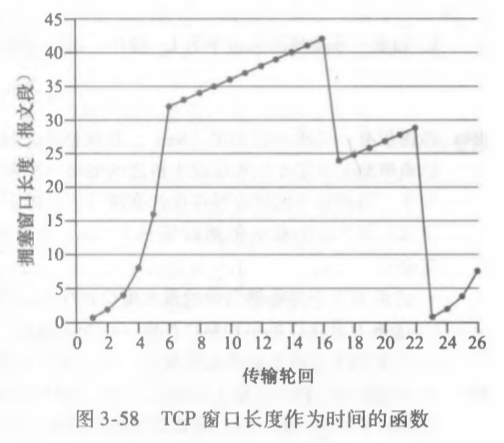
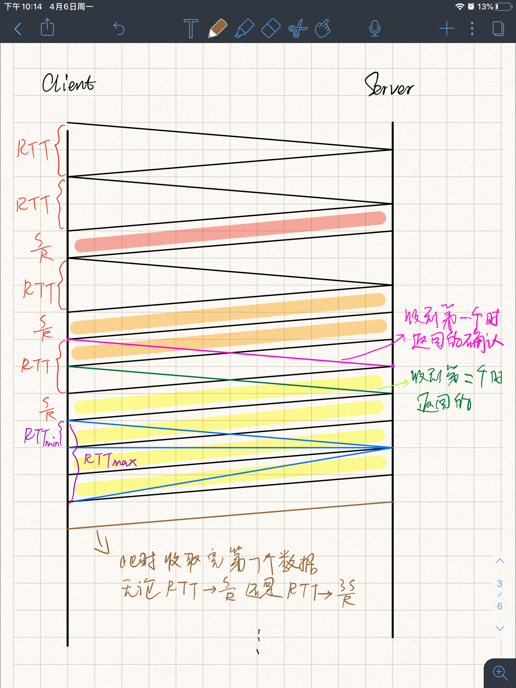
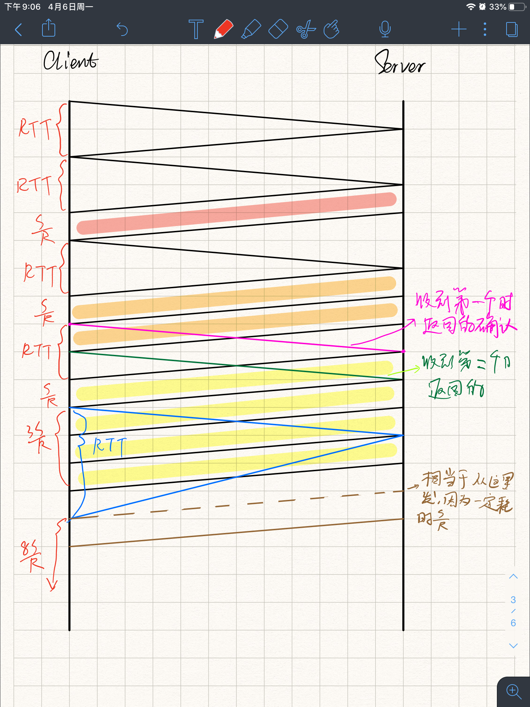
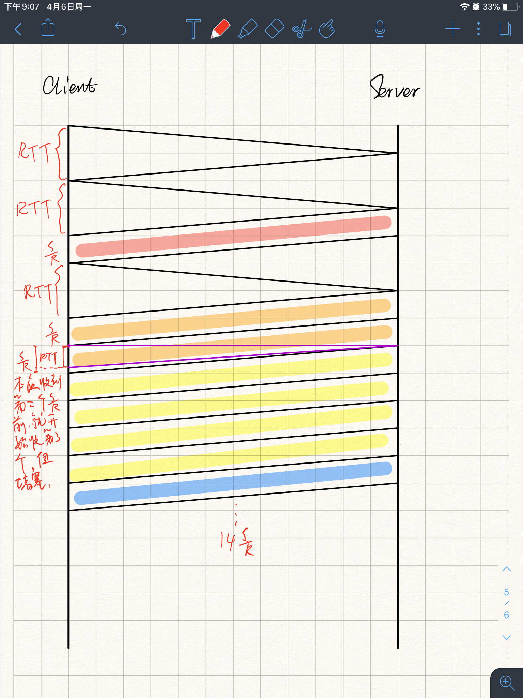

# Homework6

---

## 个人信息

- 班级：软工六班
- 学号：2017302580291
- 姓名：洪龙熙

---

## 作业

### 作业1

- 题目

> P40
>
> 
>
> 假设 TCP Reno 是一个经历如上所示行为的协议，回答下列问题。在各种情况中，简要地论证你的回答。 
>
> 1. 指出 TCP 慢启动运行时的时间间隔。 
> 2. 指出 TCP 拥塞避免运行时的时间间隔。 
> 3. 在第 16 个传输轮回之后，报文段的丢失是根据 3 个冗余 ACK 还是根据超时检测岀来的？
> 4. 在第 22 个传输轮回之后，报文段的丢失是根据 3 个冗余 ACK 还是根据超时检测出来的？
> 5. 在第 1 个传输轮回里，ssthresh 的初始值设置为多少？ 
> 6. 在第 18 个传输轮回里，ssthresh 的值设置为多少？ 
> 7. 在第 24 个传输轮回里，ssthresh的值设置为多少？
> 8. 在哪个传输轮回内发送第 70 个报文段？
> 9. 假定在第 26 个传输轮回后，通过收到 3 个冗余 ACK 检测出有分组丢失，拥塞的窗口长度和 ssthresh 的值应当是多少？
> 10. 假定使用 TCP Tahoe（而不是TCP Reno），并假定在第 16 个传输轮回收到 3 个冗余ACK。在第 19 个传输轮回，ssthresh 和拥塞窗口长度是什么？
> 11. 再次假设使用 TCP Tahoe，在第 22 个传输轮回有一个超时事件。从第 17 个传输轮回到第 22 个传输轮回（包括这两个传输轮回），一共发送了多少分组？ 

- 答案
  1. TCP 慢启动运行时的时间间隔：1 - 6，23 - 26
  2. TCP 拥塞避免运行时的时间间隔：6 - 16，17 - 22
  3. 3 个冗余的 ACK，因为第 16 个传输轮回后，cwnd 被切成半个窗口
  4. 超时，因为第 22 个传输轮回后，cwnd 被设置为 1
  5. $ssthresh = 2^5=32$
  6. $ssthresh = { {32+10}\over 2} = 21$
  7. $ssthresh = { {29}\over 2} = 14.5\approx14$，$29 = ({42 \over 2} + 3) + 5$
  8. 第 7 个传输轮回，因为第 6 个传输轮回结束后，传输了 63 个报文段，下一个传输轮回传输 33 个报文段，$63 < 70 < 63 + 33$
  9. $ssthresh = 4, cwnd=7$，因为 TCP Reno 在重复计数为 3 时，$ssthresh = {cwnd \over 2}$，$cwnd=ssthresh + 3$
  10. $ssthresh = {42 \over 2} = 21$，$cwnd=1 + 2 = 3$
  11. $n = 1 + 2 + 4 + 8 + 16 + 21=52$，第 22 个轮回是 21 的原因是 ssthresh 是 21，32 超出了阈值

### 作业2

- 题目

> P45
>
> 回想TCP吞吐量的宏观描述。在连接速率从 $W \over {2\times RTT }$ 变化到 ${W \over RTT}$ 的周期内，只丢失了一个分组（在该周期的结束）。 
>
> 1. 证明其丢包率（分组丢失的比率）等于： $L = 丢包率= {1 \over {{3\over8}W^2} + {3\over4}W}$
> 2. .如果一条连接的丢包率为 L，使用上面的结果，则它的平均速率近似由下式给出： $平均速率 \approx {{1.22 \times MSS} \over RTT \sqrt{L}}$

- 答案

  1. 由题意得，即每一个 RTT 传输得包从 $W \over 2$ 变化为 $W$
  
     由 TCP 吞吐量的宏观描述可知，其总的传包数是：
  
     $N = {W \over 2 } + ({W \over 2 } + 1) + ({W \over 2 } + 2) + \cdots + ({W \over 2 } + {W \over 2 })$
  
     ​     $ = {W \over 2} \times ({W \over 2} + 1) + \sum_{n=0}^{W\over 2}n$
  
     ​     $= {3 \over 8} W^2 + {3 \over 4} W$
  
     故：
  
     $L = {1 \over N} = {1 \over {{3\over8}W^2} + {3\over4}W}$
  
  2. $平均速率 = {3 \over 4} \times {W \over RTT} \times MSS$
  
     $L ={1 \over {{3\over8}W^2} + {3\over4}W}$
  
     $\because O(W^2) >> O(W)$
  
     $\therefore {3 \over 4}W \rightarrow 0$
  
     $\therefore W \approx \sqrt{8 \over 3L}$
     
     $\therefore平均速率 = {3 \over 4} \times {W \over RTT} \times MSS \approx {{1.22 \times MSS} \over RTT \sqrt{L}}$

### 作业3

- 题目

> P56
>
> 在这个习题中，我们考虑由 TCP 慢启动阶段引入的时延。考虑一个客户和一个 Web 服务器直接连接到速率 R 的一条链路。假定该客户要取回一个对象，其长度正好等于 15S，其中 S 是最大段长度（MSS）。客户和服务器之间的往返时间表示为 RTT（假设为常数）。忽略协议首部，确定在下列情况下取回该对象的时间（包括 TCP 连接创建）:
>
> 1. ${4S\over R} > {S \over R} + RTT > {2S \over R}$
> 2. ${S \over R} + RTT > {4S \over R}$
> 3. ${S \over R } > RTT$

- 答案

  RTT 指，从发送端发送开始，直到收到来自接收端的确认所耗时间
  
  TCP 连接创建为三次握手，需要时间 $T_0 = 2 \times RTT$
  
  此外，$15 = 1 + 2 + 4 + 8$
  
  1. 即 ${S\over R} <RTT < {3S\over R}$，$T = 4\times RTT + 14 \times {S \over R}$
  
     
  
  2. 即 ${3S\over R} < RTT$，$T = 5 \times RTT + 11 \times {S\over R}$
  
     
  
  3. 即 $RTT < {S\over R}$，$T = 3\times RTT + 15 \times {S \over R}$
  
     