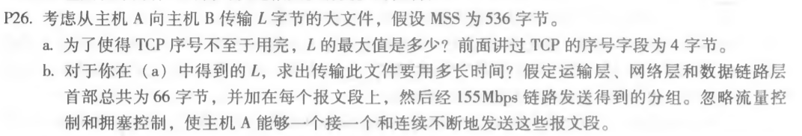
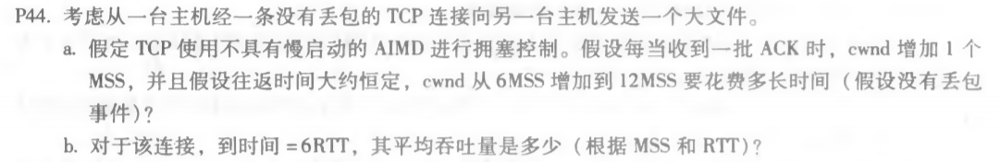
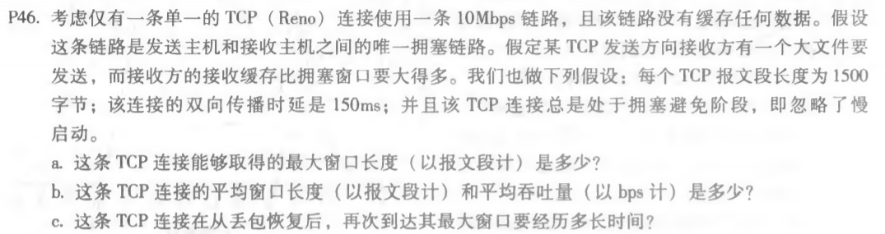

# 第六次作业

徐意 2017312580048

### 课后习题

#### p26



```
a.
  Lmax = 2^(4*8) = 2^32byte

b.	
  数据大小 = 2^32byte
  报文数 = ⌈数据大小/536⌉ = 8012999
  总头部长 = 报文数 * 66 = 528857934byte
  总大小 = 数据大小 + 总头部长
  时间 = 总大小/155Mbps = 249s
```


#### p44



```
a. 
  需要6个RTT
 
b.
  6 + 7 + 8 + 9 + 10 + 11 = 51 MSS
  平均吞吐量为 51MSS / 6RTT = 8.5 MSS/RTT
```


#### P46



```
a.
  最大窗口长度W受限于链路速率：W * MSS / RTT = 10Mbps
  得到 W = 125
  
b.
  从 W/2 到 W：
  平均窗口长度为 0.75W = 94
  平均吞吐量为 94 * 1500 * 8 / 0.15 = 7.52Mbps
  
c.
  W’ = W/2 = 62
  从 W’ 到 W：
  拥塞避免状态发送成功一次cwnd增加一个MSS
  (125-62)*150ms = 9.45s
```

